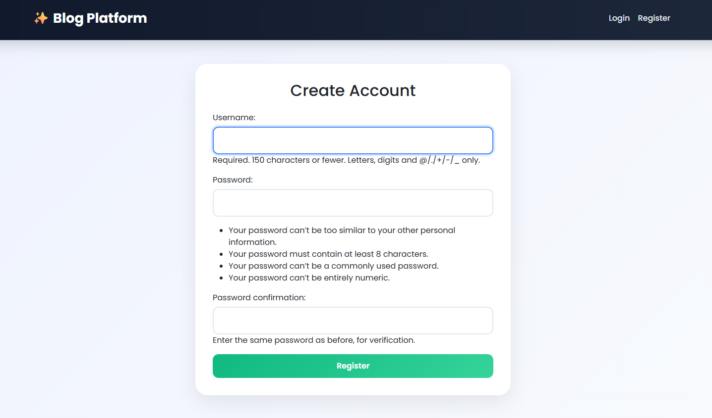
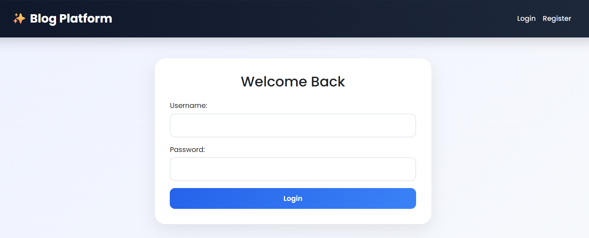
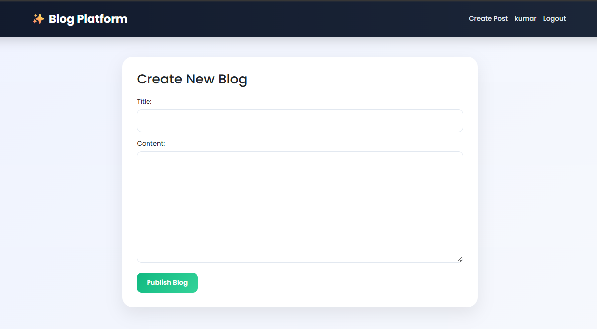
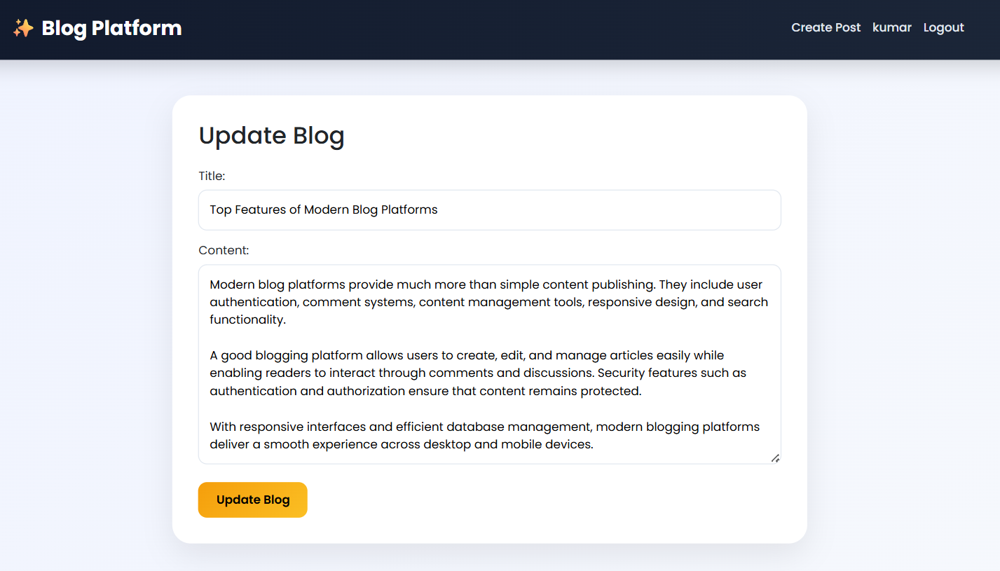
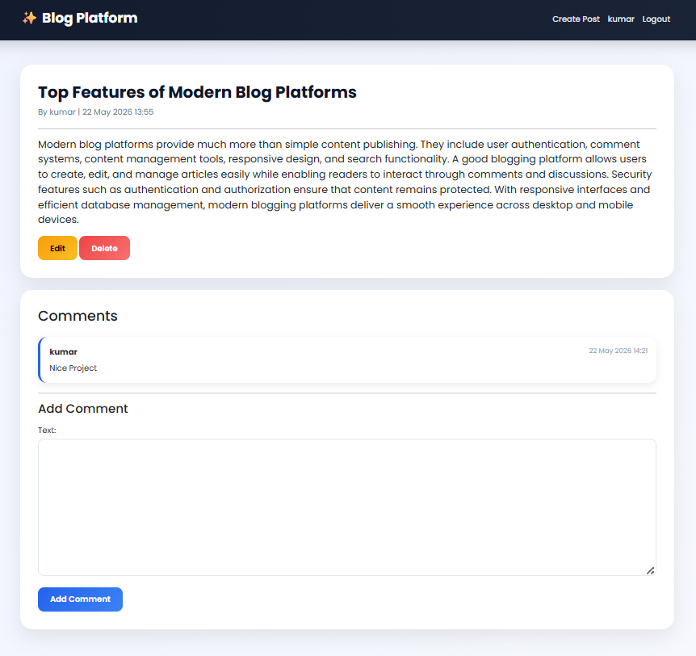

# 📝 BlogSphere - Blog Platform with Comments

A modern blogging platform built using **Django**, where users can create, update, delete blog posts and interact through comments. The platform includes authentication, content management, and a responsive user-friendly interface.

---

## 🚀 Features

### 👤 User Authentication
- User Registration
- User Login & Logout
- Secure Authentication System

### 📝 Blog Management
- Create New Blog Posts
- Update Existing Posts
- Delete Posts
- View All Published Posts
- Detailed Blog View

### 💬 Comment System
- Add Comments on Posts
- View All Comments
- User Interaction and Discussion

### 🎨 Modern UI
- Responsive Design
- Bootstrap 5 Integration
- Custom CSS Styling
- Mobile-Friendly Interface

---

## 🛠️ Tech Stack

| Technology | Usage |
|------------|--------|
| Python | Backend Language |
| Django | Web Framework |
| SQLite | Database |
| HTML5 | Structure |
| CSS3 | Styling |
| Bootstrap 5 | Responsive UI |
| Git & GitHub | Version Control |

---

## 📸 Screenshots

### Register Page

### Login Page

### Home Page

### Create Post

### Update Post

### Read Post

---

## 🎯 Learning Outcomes

This project helped in understanding:

- Django Project Structure
- Authentication & Authorization
- CRUD Operations
- Template Rendering
- Database Integration using ORM
- Bootstrap Responsive Design
- Git & GitHub Workflow

---

## 👨‍💻 Author

**Sachin Kumar**

### LinkedIn

[LinkedIn Profile](https://www.linkedin.com/in/sachin-kumar-362b53343/)

[GitHub Profile]: https://github.com/SACHIN197-creator

---

## ⭐ Support

If you like this project, consider giving it a ⭐ on GitHub.
